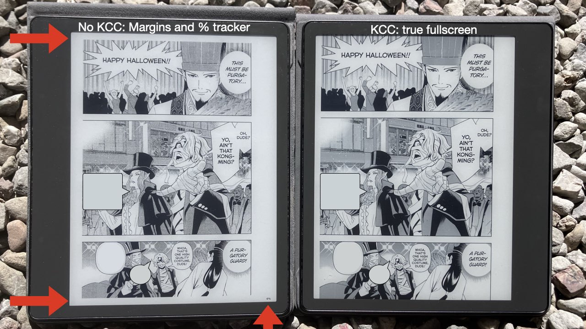
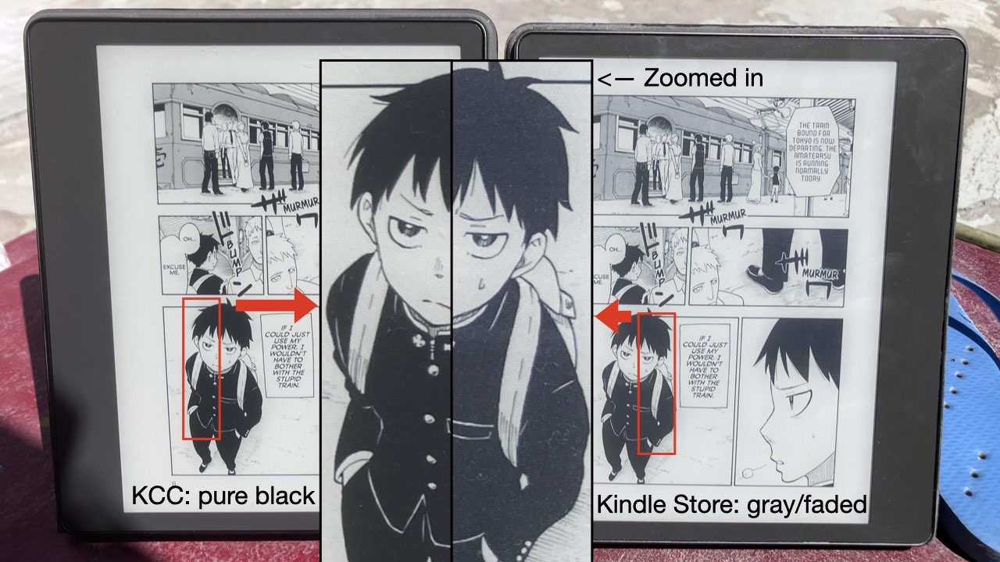
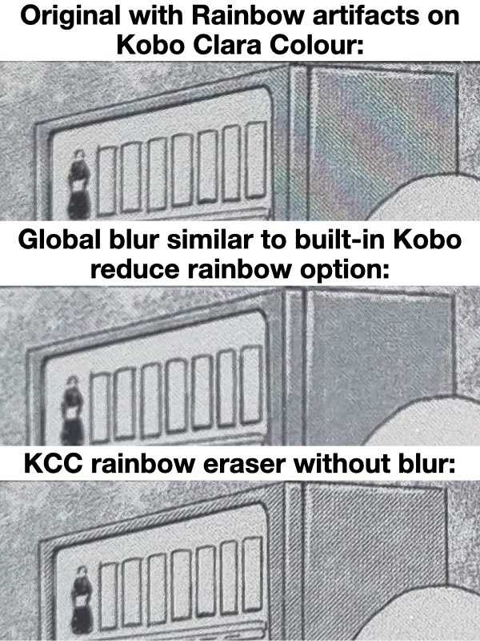
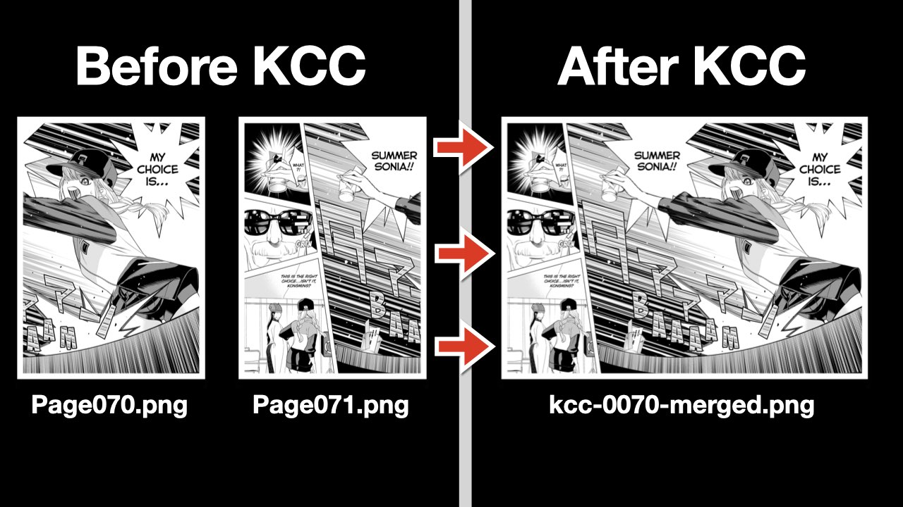
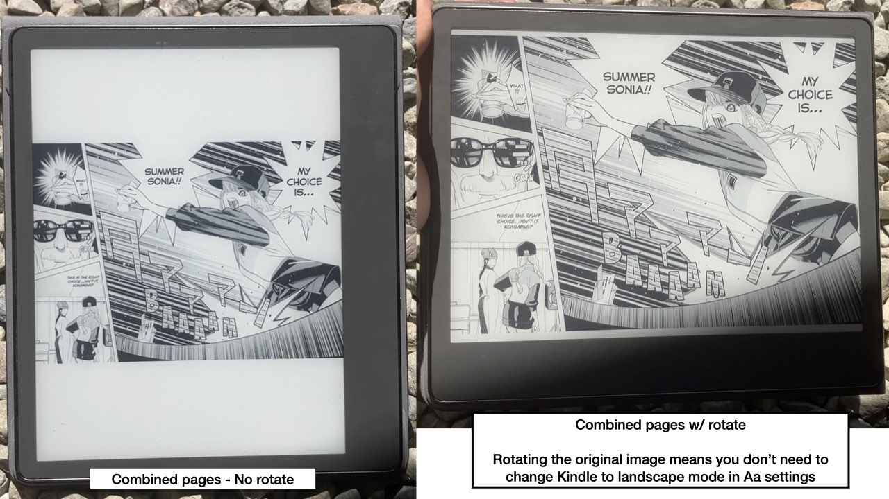
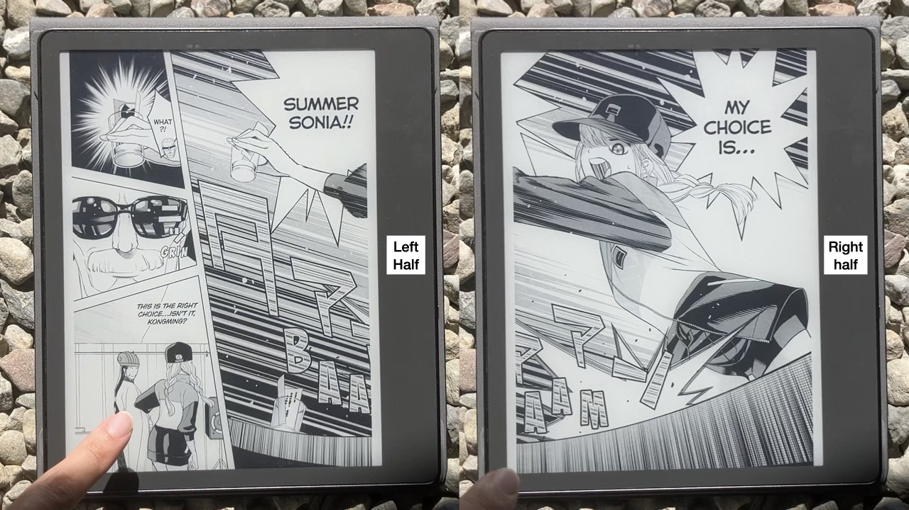
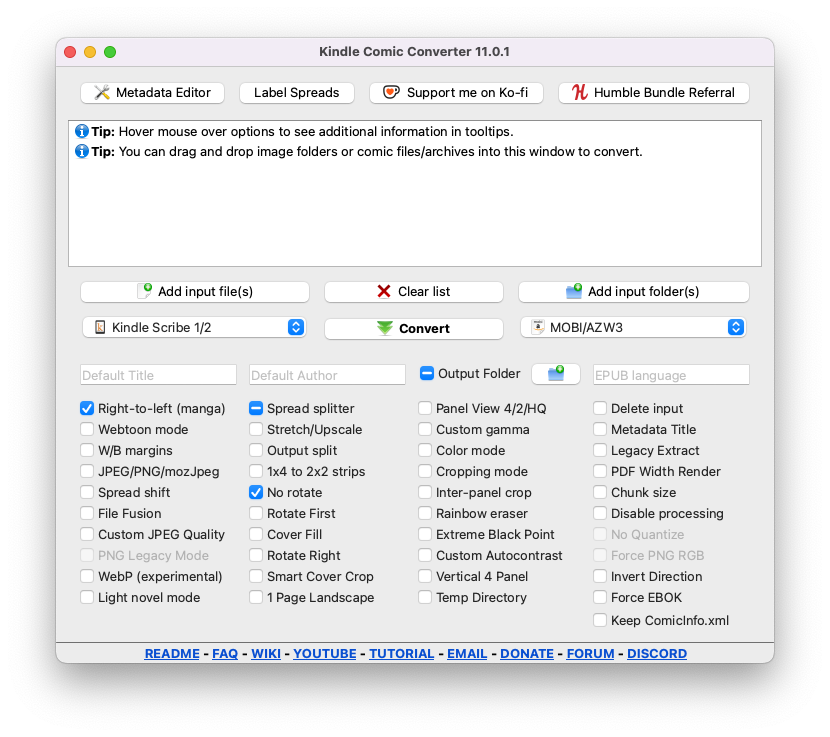

# KCC 官方文档 · 简体中文翻译

> ## ⚠️ AI 生成声明
>
> 本文件是上游 [README.md](README_upstream.md) 的**简体中文翻译，在 AI 辅助下完成，未经人工逐条校对**。
> 译文可能与原文存在出入，一切以[英文原文](README_upstream.md)为准。
>
> - 原文：https://github.com/ciromattia/kcc#readme
> - 翻译基准版本：KCC 11.2.0（2026-09 发布）
> - 本仓库的汉化版说明（安装、常见问题）见 [README.md](README.md)
>
> 命令行工具的实际输出仍为英文；下文 CLI 帮助文字中的说明已译成中文，便于理解。

---

Most manga conversion methods for ereaders add margins. But KCC enables true fullscreen from top to bottom.



（图示漫画：Ya Boy Kongming! 与 Fire Force，来自 [Humble Bundle](https://humblebundleinc.sjv.io/xL6Zv1) 的 PDF 源文件。）

# KCC

[](https://github.com/ciromattia/kcc/releases)
[](https://github.com/ciromattia/kcc/pkgs/container/kcc)
[](https://github.com/ciromattia/kcc/releases)

**Kindle Comic Converter**（KCC）为 Kindle、Kobo、reMarkable 等 E-ink 电子墨水阅读器优化黑白（或彩色）漫画。
页面可**满屏无白边**显示，并正确支持固定版式。
KCC 可运行于 Windows、macOS 与 Linux。

支持的输入格式包括文件夹内的 JPG/PNG 图片、CBZ/EPUB 等压缩包，以及 PDF。

支持的输出格式包括 MOBI/AZW3、EPUB、KEPUB、CBZ、PDF 以及图片文件夹。

质量最高的源文件是来自 [Humble Bundle](https://humblebundleinc.sjv.io/xL6Zv1)/Fanatical 的无 DRM PDF。
这类 PDF 的分辨率通常达到 x12000 以上，而即使是 10 英寸的 Kindle Scribe 也只有 x2480。

KCC 的核心目标是在显著缩小体积的同时保证最高画质。例如，KCC 可以：

1) 把 Humble Bundle 上 600 MB 的单行本漫画压缩到 100 MB。
   这主要通过把图像缩放到你所用设备的原生分辨率实现，
   同时还能延长续航、加快翻页速度，改善低配置阅读器的整体表现。

2) 修正黑位，避免许多 Kindle 商店漫画中灰白无力的黑色



3) 修复 Kaleido 3 彩色墨水屏上的[彩虹纹](https://www.youtube.com/watch?v=Dw2HTJCGMhw)且不损失清晰度：



4) 可以从预先切分的单页中[半自动检测跨页大图](https://www.youtube.com/watch?v=kfIX67f7Aqk)：



合并后的跨页可以选择旋转或不旋转观看：



拆分的单页可以排在合并跨页之前或之后：



## 演示

只需把输入文件拖进 KCC 窗口，点击转换，再用 USB 把输出文件拖到设备的 `documents` 文件夹即可！

https://github.com/user-attachments/assets/da73d625-e082-482d-91a4-ae4765e96fd7

之后所有通过 USB 导入的漫画都会和你的普通书籍一起出现在阅读器书库里！

最终效果在 10 英寸 Kindle Scribe 上非常惊艳：https://www.youtube.com/watch?v=2CIHW2N9Enc

**警告**：Kindle Scribe 2025 款的 MOBI 支持可能出现空白页，请改用 PDF。

图形界面基于 Qt6 构建，选项很多，但大多数人只用下面勾选的几个。
把鼠标悬停在选项上可以在工具提示中看到详细说明。



如果你在 macOS 上使用 2022 年之后的 Kindle，可能需要安装 Amazon USB File Manager for Mac 或 OpenMTP。

视频教程（求订阅）：https://www.youtube.com/watch?v=QQ6zJcMF2Iw

安装教程：https://www.youtube.com/watch?v=IR2Fhcm9658

## 越狱 Kindle 安装 KOreader

越狱安装 KOreader 是可选的。KCC 配合 Kindle 原生 mobi 漫画阅读器就能正常工作。

但如果你越狱并安装 KOreader，可以解锁额外能力：

1) 兼容更适合漫画的图像格式，例如 4-bit PNG 和 WEBP。相比必须 8-bit 的 JPG，可以以**一半的体积**获得更好的画质。
   由于墨水屏本身就是 4-bit，这在视觉上是无损的。
2) 不依赖 kindlegen，直接输出 CBZ 即可，转换速度可以**快一倍**。
3) 可以通过半勾选 JPG/PNG 选项来抖动处理，并改在 KCC 里完成裁剪而不是 KOreader，这有助于提升翻页速度和续航。

### 特别提醒

**KCC** *不是* [Amazon 的 Kindle Comic Creator](http://www.amazon.com/gp/feature.html?ie=UTF8&docId=1001103761)，也与 Amazon 没有任何关联、未获其认可。
Amazon 的工具面向漫画出版方，需要大量手工操作；而 **KCC** 面向漫画读者。
*KC2* 在任何意义上都不能取代 **KCC**，所以你可以放心，我们会继续维护这个小怪兽 ;-)

### 问题 / 新功能 / 捐赠

如果对使用方法、反馈等有一般性疑问，请[发到这里](http://www.mobileread.com/forums/showthread.php?t=207461)。
如果在使用 KCC 时遇到**技术**问题，请[到这里提交 issue](https://github.com/ciromattia/kcc/issues/new)。
如果你能修复某个未决 issue，欢迎 fork 并提交 pull request。

如果你觉得 **KCC** 对你有价值，可以考虑向作者捐赠：

- Ciro Mattia Gonano（创始人，2012-2014 活跃）：

  [](https://www.paypal.com/cgi-bin/webscr?cmd=_s-xclick&hosted_button_id=D8WNYNPBGDAS2)

- Paweł Jastrzębski（2013-2019 活跃）：

  [](https://www.paypal.com/cgi-bin/webscr?cmd=_s-xclick&hosted_button_id=YTTJ4LK2JDHPS)
  [](https://jastrzeb.ski/donate/)

- Alex Xu（2023 至今）

  [](https://ko-fi.com/Q5Q41BW8HS)

## 定制服务

本节内容可能变动：

咨询与合作邮箱：`kindle.comic.converter` gmail

## 赞助者

- Windows 平台的免费代码签名由 [SignPath.io](https://about.signpath.io/) 提供，证书来自 [SignPath Foundation](https://signpath.org/)

## 下载

- **https://github.com/ciromattia/kcc/releases**

在最新版本下点击 **Assets**。

你大概率需要其中之一：
- `KCC_*.*.*.exe`（Windows）
- `kcc_macos_arm_*.*.*.dmg`（Apple Silicon M1 及之后的较新 Mac）
- `kcc_macos_i386_*.*.*.dmg`（Intel 芯片的旧款 Mac，macOS 14+）

另有实验性的 macOS 10.14+ 与 Windows 7 旧版本。

`c2e` 与 `c2p` 版本是面向高级用户的命令行工具。

在 macOS 上如果提示 `can't be opened`，请参考：https://support.apple.com/guide/mac-help/open-a-mac-app-from-an-unknown-developer-mh40616/mac

Flatpak、Docker 与 AppImage 版本请参考 wiki：https://github.com/ciromattia/kcc/wiki/Installation

## 常见问题
- 应该用 Calibre 吗？
  - 不要。Calibre 对固定版式 EPUB/MOBI 支持不佳，用 Calibre 改动 KCC 输出（哪怕只改元数据！）都可能破坏排版，还会打乱页码。
    用 Calibre 查看 KCC 输出也无法正常显示。推荐直接用 USB 拖入。
- 出现空白页？
  - [Kindle Scribe 使用 PNG](https://github.com/ciromattia/kcc/issues/665) 或 [Kindle Colorsoft 使用任何格式](https://github.com/ciromattia/kcc/issues/768)时都可能出现。解决办法是 Scribe 改用 JPG，或者买一台 Kobo Colour。快速连续翻页时更常出现。可以尝试 PDF 输出。
    往回翻几页然后退出再重新进入书籍，通常能临时恢复。
- 该用什么输出格式？
  - Kindle 用 MOBI。Kindle DX 用 CBZ。KOreader 用 CBZ。Kobo 用 KEPUB。reMarkable 或 Kindle Scribe 2025 用 PDF。
- KEPUB 选项在哪？
  - 选择 Kobo 设备配置并选择 EPUB 输出，即会输出 KEPUB。
- 所有选项的详细信息都可以在悬停工具提示中查看。
- 要把转换好的书传到 Kindle/Kobo，只需通过 USB 把 mobi/kepub 拖到设备的 documents 文件夹
- Kindle 的 Panel View（面板视图）不工作？
  - 从 7.4 版本起，虚拟面板视图需要在 Kindle 的 Aa 菜单里开启，而不是在 KCC 中
- 从右到左模式不工作？
  - RTL 模式只影响 CBZ 输出的切分顺序，翻页方向由你的 CBZ 阅读器自行决定。
- 颜色反了？
  - 关闭 Kindle 的深色模式
- 无法在 macOS 上连接 Kindle Scribe 或 2024 年后的 Kindle
  - 使用官方 MTP 工具 [Amazon USB File Transfer](https://www.amazon.com/gp/help/customer/display.html/ref=hp_Connect_USB_MTP?nodeId=TCUBEdEkbIhK07ysFu)（无需登录）。比之前推荐的 Android File Transfer 好得多。不能与其他传输工具同时运行。
- 如何生成 AZW3 而不是 MOBI？
  - KCC 生成的 `.mobi` 是双格式文件，同时是 MOBI 和 AZW3。为兼容起见扩展名保留 `.mobi`。
- 白边巨大 / 翻页慢？
  - 多半是传输过程中被第三方应用改动了文件。请直接把最终的 mobi/kepub 通过 USB 拖入 Kindle 的 documents 文件夹。

## 前置条件

需要安装若干工具才能使用重要但可选的功能。安装后请**关闭并重新打开 KCC** 以便识别。

### KindleGen

在 Windows 和 macOS 上，安装 [Kindle Previewer](https://www.amazon.com/Kindle-Previewer/b?ie=UTF8&node=21381691011)，KCC 会自动检测其中的 `kindlegen`。

如果检测失败、卡在 MOBI 转换步骤，或你使用 Linux AppImage/Flatpak，请参考 wiki：https://github.com/ciromattia/kcc/wiki/Installation#kindlegen

### 7-Zip

可选，但能显著加快转换速度。

处理某些文件和高级功能时必需。

缺少数时会提示安装。

安装参考 wiki：https://github.com/ciromattia/kcc/wiki/Installation#7-zip

## 输入格式
**KCC** 目前支持识别并转换以下输入类型：
- 包含 PNG、JPG、GIF 或 WebP 文件的文件夹
- CBZ、ZIP（*需要 `7z` 可执行文件*）
- CBR、RAR（*需要 `7z` 可执行文件*）
- CB7、7Z（*需要 `7z` 可执行文件*）
- PDF（*仅提取其中的 JPG 图像*）

## 用法

应该不需要解释。所有选项的工具提示里都有详细说明。
转换完成后，输出文件会与原始输入文件放在同一目录。

更多细节请查看[我们的 wiki](https://github.com/ciromattia/kcc/wiki/)。

**KCC** 的命令行版本面向高级用户，允许使用可能互不兼容、降低输出质量的选项组合。
命令行版本依赖更少，在 Debian 系发行版上以下命令可装齐全部依赖：
```
sudo apt-get install python3 p7zip-full python3-pil python3-psutil python3-slugify
```

### 设备配置：

```
        'K1': ("Kindle 1", (600, 670), Palette4, 1.0),
        'K2': ("Kindle 2", (600, 670), Palette15, 1.0),
        'K11': ("Kindle 11", (1072, 1448), Palette16, 1.0),
        'K34': ("Kindle Keyboard/Touch", (600, 800), Palette16, 1.0),
        'K57': ("Kindle 5/7", (600, 800), Palette16, 1.0),
        'K810': ("Kindle 8/10", (600, 800), Palette16, 1.0),
        'KDX': ("Kindle DX/DXG", (824, 1000), Palette16, 1.0),
        'KPW': ("Kindle Paperwhite 1/2", (758, 1024), Palette16, 1.0),
        'KV': ("Kindle Voyage", (1072, 1448), Palette16, 1.0),
        'KPW34': ("Kindle Paperwhite 3/4", (1072, 1448), Palette16, 1.0),
        'KPW5': ("Kindle Paperwhite 5/Signature Edition", (1236, 1648), Palette16, 1.0),
        'KPW6': ("Kindle Paperwhite 6", (1272, 1696), Palette16, 1.0),
        'KO': ("Kindle Oasis 2/3", (1264, 1680), Palette16, 1.0),
        'KCS': ("Kindle Colorsoft", (1272, 1696), Palette16, 1.0),
        'KS1860': ("Kindle 1860", (1860, 1920), Palette16, 1.0),
        'KS1920': ("Kindle 1920", (1920, 1920), Palette16, 1.0),
        'KS1240': ("Kindle 1240", (1240, 1860), Palette16, 1.0),
        'KS1324': ("Kindle 1324", (1324, 1986), Palette16, 1.0),
        'KS': ("Kindle Scribe 1/2", (1860, 2480), Palette16, 1.0),
        'KS3': ("Kindle Scribe 3", (1986, 2648), Palette16, 1.0),
        'KSCS': ("Kindle Scribe Colorsoft", (1986, 2648), Palette16, 1.0),
        'KoMT': ("Kobo Mini/Touch", (600, 800), Palette16, 1.0),
        'KoG': ("Kobo Glo", (768, 1024), Palette16, 1.0),
        'KoGHD': ("Kobo Glo HD", (1072, 1448), Palette16, 1.0),
        'KoA': ("Kobo Aura", (758, 1024), Palette16, 1.0),
        'KoAHD': ("Kobo Aura HD", (1080, 1440), Palette16, 1.0),
        'KoAH2O': ("Kobo Aura H2O", (1080, 1430), Palette16, 1.0),
        'KoAO': ("Kobo Aura ONE", (1404, 1872), Palette16, 1.0),
        'KoN': ("Kobo Nia", (758, 1024), Palette16, 1.0),
        'KoC': ("Kobo Clara HD/Kobo Clara 2E", (1072, 1448), Palette16, 1.0),
        'KoCC': ("Kobo Clara Colour", (1072, 1448), Palette16, 1.0),
        'KoL': ("Kobo Libra H2O/Kobo Libra 2", (1264, 1680), Palette16, 1.0),
        'KoLC': ("Kobo Libra Colour", (1264, 1680), Palette16, 1.0),
        'KoF': ("Kobo Forma", (1440, 1920), Palette16, 1.0),
        'KoS': ("Kobo Sage", (1440, 1920), Palette16, 1.0),
        'KoE': ("Kobo Elipsa", (1404, 1872), Palette16, 1.0),
        'Rmk1': ("reMarkable 1", (1404, 1872), Palette16, 1.0),
        'Rmk2': ("reMarkable 2", (1404, 1872), Palette16, 1.0),
        'RmkPP': ("reMarkable Paper Pro", (1620, 2160), Palette16, 1.0),
        'RmkPPMove': ("reMarkable Paper Pro Move", (954, 1696), Palette16, 1.0),
        'OTHER': ("Other", (0, 0), Palette16, 1.0),
```

### 独立版 `kcc-c2e.py` 用法：

```
usage: kcc-c2e [options] [input]

必填：
  input                 要处理的漫画文件夹或文件的完整路径。

主要选项：
  -p PROFILE, --profile PROFILE
                        设备配置（可选值：K1, K2, K34, K578, KDX, KPW, KPW5, KV, KO, K11, KS, KoMT, KoG, KoGHD, KoA, KoAHD, KoAH2O, KoAO, KoN, KoC, KoCC, KoL, KoLC, KoF, KoS, KoE）
                        [默认=KV]
  -m, --manga-style     漫画风格（从右到左阅读与切分）
  --lightnovel          仅缩放图像并保留原始文件结构。
  --ebok                MOBI 使用 EBOK 标签而非 PDOC
  --invertdirection     反转翻页方向
  -q, --hq              尝试提高放大画质
  -2, --two-panel       面板视图模式下显示两个而非四个面板
  --vertical4panel       虚拟面板视图中先显示侧边面板
  -w, --webtoon         条漫处理模式
  --ts TARGETSIZE, --targetsize TARGETSIZE
                        输出文件的最大体积（MB）。[条漫默认=100MB，其他=400MB]

处理选项：
  -n, --noprocessing    不修改图像，忽略所有设备配置和处理选项
  --legacyextract       使用早期 KCC 版本的 PDF/EPUB 图像提取方式。
  --pdfwidth            矢量 PDF 按设备宽度而非高度渲染。
  -u, --upscale          小于设备分辨率的图像会被放大
  -s, --stretch         把图像拉伸到设备分辨率
  --wallpaper           裁剪图像以铺满屏幕
  -r SPLITTER, --splitter SPLITTER
                        跨页处理模式。0：切分 1：旋转 2：两者 [默认=0]
  -g GAMMA, --gamma GAMMA
                        应用伽马校正以线性化图像 [默认=自动]
  --autolevel           把最常见的暗像素值设为黑点。
  --noautocontrast      禁用自动对比度
  --colorautocontrast   对所有页面强制自动对比度。接近纯黑/纯白的页面会跳过
  -c CROPPING, --cropping CROPPING
                        设置裁剪模式。0：禁用 1：边距 2：边距+页码 [默认=2]
  --cp CROPPINGP, --croppingpower CROPPINGP
                        设置裁剪力度 [默认=1.0]
  --preservemargin      计算裁剪边界后，按指定百分比向外"回退" [默认=0]
  --cm CROPPINGM, --croppingminimum CROPPINGM
                        设置最小裁剪面积比 [默认=0.0]
  --ipc INTERPANELCROP, --interpanelcrop INTERPANELCROP
                        裁掉空白区域。0：禁用 1：横向 2：双向 [默认=0]
  --blackborders        禁用自动检测，强制使用黑色边框
  --whiteborders        禁用自动检测，强制使用白色边框
  --smartcovercrop      尝试从宽幅图像中裁出主封面
  --coverfill           仅对封面居中裁剪以铺满目标设备屏幕
  --forcecolor         不转换为灰度
  --forcepng            黑白图像使用 PNG 而非 JPEG
  --webp                用有损 WEBP 替换 JPG、无损 WEBP 替换 PNG
  --force-png-rgb       强制彩色图像保存为 PNG
  --pnglegacy           使用兼容性更好的 8-bit PNG 而非 4-bit。
  --noquantize          不把 PNG 图像量化为 16 色
  --mozjpeg             使用 mozJpeg 生成 JPEG
  --jpeg-quality        JPEG 质量，范围 0（最差）到 95（最好）。多数设备默认 85。
  --maximizestrips      把 1x4 条带转为 2x2
  -d, --delete          删除源文件或目录。不可恢复。
  --tempdir             在源文件所在磁盘创建临时目录。

输出设置：
  -o OUTPUT, --output OUTPUT
                        输出文件放到指定目录或按指定文件名输出
  -t TITLE, --title TITLE
                        漫画标题 [默认=文件名或目录名]
  --metadatatitle       使用 ComicInfo.xml 或内嵌元数据中的标题。0：不使用元数据标题 1：元数据标题与默认命名组合 2：仅使用元数据标题 [默认=0]
  --keepcomicinfo       保留原始 ComicInfo.xml 文件 [默认=0]
  -a AUTHOR, --author AUTHOR
                        作者名 [默认=KCC]
  --language            EPUB 语言 [默认=en-US]
  -f FORMAT, --format FORMAT
                        输出格式（可选值：Auto, MOBI, EPUB, CBZ, PDF, KFX, MOBI+EPUB）[默认=Auto]
  --nokepub             若格式为 EPUB，输出 `.epub` 扩展名而非 `.kepub.epub`
  -b BATCHSPLIT, --batchsplit BATCHSPLIT
                        把输出拆分为多个文件。0：不拆分 1：自动模式 2：每个子目录视为独立一卷 [默认=0]
  --spreadshift         横向模式下把首页移到另一侧以对齐跨页
  --onepagelandscape    横向模式下单页居中显示
  --norotate            跨页拆分选项下不旋转跨页。
  --rotateright         跨页按相反方向旋转。
  --rotatefirst         跨页拆分选项下把旋转页放在前面。
  --filefusion          把所有输入文件合并为单个文件。
  --eraserainbow       通过衰减干扰频率消除彩色墨水屏的彩虹纹

自定义设备：
  --customwidth CUSTOMWIDTH
            覆盖设备配置提供的屏幕宽度
  --customheight CUSTOMHEIGHT
            覆盖设备配置提供的屏幕高度

其他：
  -h, --help            显示本帮助并退出

```

### 独立版 `kcc-c2p.py` 用法：

```
usage: kcc-c2p [options] [input]

必填：
  input                 要处理的漫画文件夹。多个输入用空格分隔。

主要选项：
  -y HEIGHT, --height HEIGHT
                        目标设备屏幕高度
  -i, --in-place        覆盖源目录
  -m, --merge           切分前把所有目录合并为单张长图

其他：
  -d, --debug           为每张切分图生成调试文件
  -h, --help            显示本帮助并退出
```

## 从源码安装

本节面向想为 KCC 贡献代码的开发者，以及想运行最新代码而不等官方发布的高级用户。

最简单的方式是用 [GitHub Desktop](https://desktop.github.com) 克隆你的 KCC fork。在 GitHub Desktop 中点击工具栏的 `Repository`，再点击 `Command Prompt`（Windows）/ `Terminal`（Mac）在 KCC 仓库中打开命令行窗口。

根据系统不同，[Python](https://www.python.org) 可能叫 `python` 或 `python3`。我们使用虚拟环境（venv）管理依赖。

如果你想改代码，[VS Code](https://code.visualstudio.com) 是个不错的编辑器。

如果你想编辑 `.ui` 文件，请使用 `pip install pyside6` 附带的 `pyside6-designer`。
如果新增了控件，请用[Tab Order 编辑模式](https://doc.qt.io/qt-6/designer-tab-order.html)确认 Tab 顺序正确。
然后用 `gen_ui_files` 脚本自动生成 Python UI。

一个新增复选框的示例 PR：https://github.com/ciromattia/kcc/pull/785

新增复选框的视频演示：https://youtu.be/g3I8DU74C7g

不要用 `git merge` 合并上游 master，
请在你 fork 的 GitHub 页面上使用 "Sync fork" 按钮同步你的分支，
避免 pull request 中出现奇怪的合并记录。

改动时请注意你的修改对文件切分/分块以及章节对齐的影响。

### Windows 从源码安装

首次一次性设置并运行：
```
python -m venv venv
venv\Scripts\activate.bat
pip install --upgrade pip
pip install -r requirements.txt
python kcc.py
```

每次关闭命令行后需要重新激活虚拟环境再运行：
```
venv\Scripts\activate.bat
python kcc.py
```

可以像官方发布那样构建 `.exe`：
```
python setup.py build_binary
```

### macOS 从源码安装

如果系统自带的 Python 有问题，请从 brew 或官网安装最新版 Python。

首次一次性设置并运行：
```
python3 -m venv venv
source venv/bin/activate
pip install --upgrade pip
pip install -r requirements.txt
python kcc.py
```

每次关闭终端后需要重新激活虚拟环境再运行：
```
source venv/bin/activate
python kcc.py
```

可以像官方发布那样构建 `.app`：
```
python setup.py build_binary
```

## 制作人员

**KCC** 由以下作者开发：

- [Ciro Mattia Gonano](http://github.com/ciromattia)
- [Paweł Jastrzębski](http://github.com/AcidWeb)
- [Darodi](http://github.com/darodi)
- [Alex Xu](http://github.com/axu2)

本工具诞生于 **Dc5e** 的 `KindleComicParser`（发布于[这里](http://www.mobileread.com/forums/showthread.php?t=192783)）的跨平台替代方案。

应用依赖并包含以下脚本：

 - **K. Hendricks** 的 `DualMetaFix` 脚本，以 GPL-3 许可发布。
 - 来自 **Alex Yatskov** 的 [Mangle](https://github.com/FooSoft/mangle/) 的 `image.py` 类，含 [proDOOMman](https://github.com/proDOOMman/Mangle)'s 与 [Birua](https://github.com/Birua/Mangle)'s 的补丁。
 - 图标由 **Nikolay Verin**（[http://ncrow.deviantart.com/](http://ncrow.deviantart.com/)）创作，以 [CC BY-NC-SA 3.0](http://creativecommons.org/licenses/by-nc-sa/3.0/) 许可发布。

## KCC 生成的样例文件

https://www.mediafire.com/folder/ixh40veo6hrc5/kcc_samples

旧链接（已失效）：

* [Kindle Oasis 2 / 3](http://kcc.iosphe.re/Samples/Ubunchu!-KO.mobi)
* [Kindle Paperwhite 3 / 4 / Voyage / Oasis](http://kcc.iosphe.re/Samples/Ubunchu!-KV.mobi)
* [Kindle Paperwhite 1 / 2](http://kcc.iosphe.re/Samples/Ubunchu!-KPW.mobi)
* [Kindle](http://kcc.iosphe.re/Samples/Ubunchu!-K578.mobi)
* [Kobo Aura](http://kcc.iosphe.re/Samples/Ubunchu-KoA.kepub.epub)
* [Kobo Aura HD](http://kcc.iosphe.re/Samples/Ubunchu-KoAHD.kepub.epub)
* [Kobo Aura H2O](http://kcc.iosphe.re/Samples/Ubunchu-KoAH2O.kepub.epub)
* [Kobo Aura ONE](http://kcc.iosphe.re/Samples/Ubunchu-KoAO.kepub.epub)
* [Kobo Forma](http://kcc.iosphe.re/Samples/Ubunchu-KoF.kepub.epub)

## 隐私
**KCC** 仅在两种情况下发起网络连接：
* 启动时 - 检查新版本与公告。

## 已知问题
请查看 [wiki 页面](https://github.com/ciromattia/kcc/wiki/Known-issues)。

## 版权
Copyright (c) 2012-2025 Ciro Mattia Gonano, Paweł Jastrzębski, Darodi and Alex Xu.
**KCC** 基于 ISC 许可证发布；详见 [LICENSE.txt](./LICENSE.txt)。

## Verification
Impact-Site-Verification: ffe48fc7-4f0c-40fd-bd2e-59f4d7205180
